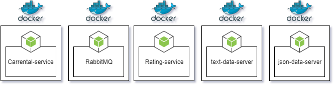
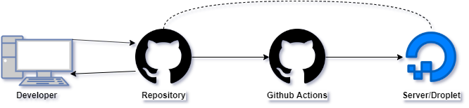

# System Integration Mini Project 3: Microservices Architecture

Assignment: [Link](https://github.com/datsoftlyngby/soft2019fall-si/blob/master/docs/Sessions/Week47/Assignment.md)

A further development of [Miniproject2](https://github.com/PBA-SOFT-System-Integration-Homework/Miniproject2)

## Authors Details

- Mathias Bigler (cph-mb493@cphbusiness.dk)
- Stanislav Novitski (cph-sn183@cphbusiness.dk)
- Alexander Winther Hørsted-Andersen (cph-ah353@cphbusiness.dk)

## Architecture

The system is separated into several docker containers:



### Execution Flow / Sequence Diagram
The basic execution flow is the same as in the previous iteration of the Miniproject. It can be found [here](https://github.com/PBA-SOFT-System-Integration-Homework/Miniproject2/blob/master/assets/Miniproject2.png)


## CI/CD Pipeline

The CI/CD Pipeline is handled by Github Actions, Githubs own execution environment: 



On code commit to the project repository, the .github/workflows/main.yml file is executed, and the below described Deployment happens:

## Deployment

- A container is setup with ubuntu
- within, the "ssh-action" is used to SSH into server/droplet to host the Microservices project, using predefined secrets.
- Inside the server/droplet, the latest repository version is downloaded.

Then, the following Composition / Orchestration occurs:


## Composition & Orchestration

On the server/droplet, the following commands are executed:


```
docker-compose build
docker-compose up -d
``` 

This will load the configuration in [docker-compose.yml](docker-compose.yml) and thus start building and execution of the generated docker images to start/setup the following microservices:

Microservice     | Description                            | Link                        | Details
---------------- | -------------------------------------- | --------------------------- | --------------------
json-data-server | Nodejs server serving car data as json | <http://167.172.98.125:3001/car> |
text-data-server | Nodejs server serving car data as text | <http://167.172.98.125:3002/car> |
RabbitMQ         | RabbitMQ message broker                | <http://167.172.98.125:15672>    | guest/guest to login
carrental-service | Nodejs service fetching car data from data servers| service running on port 3003 |
rating-service | NodeJS microservice REST API | Service running on port 3004 (see table below)| Handles user rating questions and additional questions


### Rating-service API endpoints


Endpoint | Method | Result
---------|---------|--------
[/questions/rating](http://167.172.98.125:3004/questions/rating) | GET | JSON with rating questions for inquirer
[/questions/additional](http://167.172.98.125:3004/questions/additional)| GET | JSON with additional questions inquirer
[/feedback](http://167.172.98.125:3004/feedback) | POST | JSON with feedback answers
[/feedback](http://167.172.98.125:3004/feedback) | GET | JSON with all feedback


### Hints
Docker on deployed ubunut server gives an error with user not allowed this is the fix :
```sh 
sudo usermod -aG docker $USER

sudo chmod 755 -R .
```